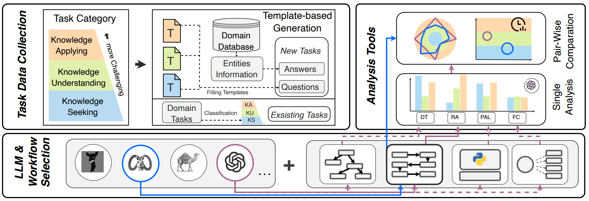

# R-Eval
R-Eval is a Python toolkit designed to streamline the evaluation of different RAG workflows in conjunction with LLMs. Our toolkit, which supports popular built-in RAG workflows and allows for the incorporation of customized testing data on the specific domain.



We summarize the traits of R-Eval as follows:

- **User-friendly**: R-Eval provides easy-to-use scripts for running and analysing experiments with the given models and datasets automatically.
- **Modular**: R-Eval is designed to be modular, which allows users to easily extend the framework with new models, datasets, and analysis tools.
- **Extensibility**: The domain-agnostic design of R-Eval makes it easy to evaluate Retrieval Augmented Large Language Models on new domain based on our framework.

# ❗ News
- **[2024.4.8]** The **v0.1.2** version of R-Eval toolkit is released! 📝 In this version, we update our README and provide detailed instructions on how to use our toolkit on new domain or add new models.
- **[2024.2.9]** The **v0.1.1** version of R-Eval toolkit is released! 🚀 In this version, we support 4 popular RAG workflows including DFSDT(DT), ReAct(RA), PAL and GPT Function Calling (FC). We report the evaluation results on 2 domain (Wikipedia and Aminer).

# Getting Started
R-Eval currently supports an evaluation of 21 RALLMs across 3 task levels and 2 representative domains while you can also customize your own evaluation settings. All the functions are now available in our toolkit:

By cloning our GitHub repository, you will be able to customize the evaluation by preparing a query API for domain database and RALLM, i.e.,


- Step 1: Install the package requirements
- Step 2 (extensible): Prepare the domain database and RALLMs
- Step 3: Run evaluation and analysis


# Usage

## [Step 1] Install Package Requirements


For client:
```
pandas
gym
numpy
tiktoken
langchain
wikipedia
```

For gpu server:
```
transformers
torch
```

## [Step 2] Prepare the domain database and RALLMs

### [Custom] Add new domain databases

Under the `environment` folder, you can find the implementation of the environment for Wikipedia and AMiner in `environment/wiki_run` and `environment/aminer_run`. In fact, the environment is just the APIs for querying the domain database.

In short, we directly use the LangChain's DocstoreExplorer which can search the Wikipedia articles by the title. For aminer domain, we provide the specific search APIs for the AMiner database.

If you want to add new domain databases, you can refer to the existing implementations and create the files in the `environment` folder.


### [Custom] Add new RAG workflows

In `agent_arch.py`, there are the implementation of RAG workflows, most of the running logics are in this file. If you want to add new RAG workflows, you can refer to the existing RAG workflows and edit this file.

The **prompts** for each RAG workflow are stored in  `fewshot.py`, which contain the examples of few-shot learning. You can also add new prompts for new RAG workflows in this file.

### [Custom] Add new large language models

Apart from those widely-used OpanAI models which can be called via API, we can also add some open-source models to run like `llama2` and `tulu`. 

On the gpu server，we use FastAPI to run the models. First enter the `environment/server` folder, then run the command as follows (**Please set the model_names in infer.py first**):

```
CUDA_VISIBLE_DEVICES=5,7 nohup uvicorn infer:app --host '0.0.0.0' --port 9627  > models.log &
```

Note that the number of model_names should be equal to the number of GPUs. For example, if you have 2 models in the model_names, then you should have 2 GPUs.


## [Step 3] Run evaluation and analysis
First, You can use `pred.py` to run the RALLM tests. The usage is as follows:

```
python3 pred.py --agent_name React_wiki_run_Agent --model vicuna-13b --environment wiki --dataset hotpotqa --num_workers 1
```
The parameters are as follows:
- `--agent_name`: the name of the RAG workflow
- `--model`: the name of the large language model
- `--environment`: the name of the domain database (wiki or aminer)
- `--dataset`: the name of the task dataset on this domain

or just run the `shells/test_hotpotqa.sh` script.


Then, you can use `analysis.py` to analyze the results. The usage is as follows:

```
python3 benchmark/analysis.py --agent_name React_wiki_run_Agent --model vicuna-13b --aspect [performance|deploy|error]
```
The `--aspect` can be one of the following: performance, error, deploy. 

These aspects correspond to the matching analysis (Sec. 5.1), error analysis (Sec. 5.2) and deployment analysis (Sec. 5.3) respectively in our paper.


# [Details] Directory Structure 


## For Wikipedia Domain
We directly use the LangChain's DocstoreExplorer which can search the Wikipedia articles by the title.
The file at wiki_run/wikienv.py is similar to the files in LangChain, but wikienv.py is actually not used.

Here are the usage of the files in wiki_run:
- For RAG workflows:
    - agent_arch.py: the RAG workflows, most of the running logics are in this file
    - fewshot.py: the examples of few-shot learning
    - pre_prompt.py: the prompts for wikipedia QA tasks
    - config.py: the configuration of apis
    - llms.py: the language models
- For environment:
    - wikienv.py: the environment for Wikipedia
    - wrappers.py: the wrappers for the environment
    - utils.py: the utils for the environment
    - evaluate.py: the evaluation of the environment


## For AMiner Domain

The files in aminer_run are similar with those in wiki_run, we provide these apis for the AMiner environment in aminer_run/agent_arch.py:

- **searchPerson**. The searchPerson function, which is based on the scholar entities' information in Aminer, receives the name, organization and interest of this intended scholar and returns the detailed information including person's id, citation number and publication number  via fuzzy match.


- **searchPublication**. The searchPublication function, which is based on the publication entities' information in Aminer, receives the publication information and returns the related information including publication's id, title and publication year via fuzzy match.


- **getCoauthors**. The getCoauthors function, which is based on the relation information between scholar entities, receives the person id then returns the input scholar's coauthors and their detailed information including id, name and relation via exact match.

- **getPersonInterest**. The getPersonInterest function, which is based on the property information of scholar entities in Aminer, receives the scholar's id and returns a list of the person's interested research topics via exact match.

- **getPublication**. The getPublication function, which is based on the property information of publication entities in Aminer, receives the publication's id and returns its detailed information including the publication's abstract, author list and the number of citation via exact match.

- **getPersonBasicInfo**. The getPersonBasicInfo function, which is based on the scholar entities' property information in Aminer, receives the person's id of this intended scholar and returns the detailed information including person's name, gender, organization, position, short bio, education experience and email address via exact match. In fact, these information consists of the person's profile.

- **getPersonPubs**. The getPersonPubs function, which is based on the relation information between publication entities and  scholar entities in Aminer, receives the person's id, and returns the detailed information including the publication's id, title, citation number and the authors' name list via exact match.
